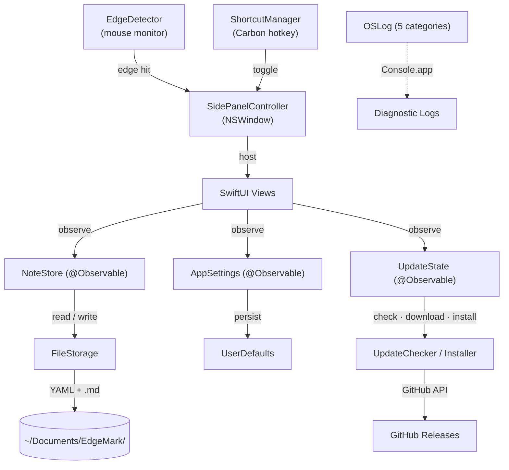

# Contributing to EdgeMark

**Requirements:** macOS 15.7+, Xcode 16.2+, [Homebrew](https://brew.sh)

```bash
brew install swiftformat
```

Code style is enforced by [SwiftFormat](https://github.com/nicklockwood/SwiftFormat) via CI — rules are in `.swiftformat` at the project root.

---

# Architecture

## Data Flow



## Source Tree

```
EdgeMark/
├── App/                            # Entry point + global state
│   ├── EdgeMarkApp.swift           #   @main, menu bar utility (LSUIElement)
│   ├── AppDelegate.swift           #   Lifecycle, storage migration, shortcut setup
│   └── ContentView.swift           #   Navigation shell (folders → notes → editor)
│
├── Core/                           # Business logic — no SwiftUI imports
│   ├── Editor/
│   │   ├── MarkdownEditorView.swift      # WKWebView ↔ CodeMirror 6 bridge
│   │   ├── ReadOnlyMarkdownView.swift    # Read-only Markdown preview (trash)
│   │   ├── SlashCommandHandler.swift     # /h1, /todo, /code, /quote routing
│   │   └── SlashCommandPopup.swift       # Floating autocomplete popup
│   ├── Settings/
│   │   └── AppSettings.swift       #   @Observable — sort order, date format, prefs
│   ├── Shortcuts/
│   │   ├── ShortcutManager.swift   #   Carbon RegisterEventHotKey global shortcut
│   │   ├── ShortcutSettings.swift  #   UserDefaults persistence for settings
│   │   └── KeyCodeTranslator.swift #   Virtual key code → display string mapping
│   ├── Storage/
│   │   ├── NoteStore.swift         #   @Observable — note CRUD, trash, folders
│   │   ├── FileStorage.swift       #   Plain .md files with YAML front matter
│   │   ├── Note.swift              #   Note model (id, title, body, timestamps)
│   │   ├── Folder.swift            #   Folder model
│   │   └── TrashedFolder.swift     #   Trashed folder with expiry metadata
│   ├── Updates/
│   │   ├── UpdateChecker.swift     #   GitHub Releases API, version comparison
│   │   ├── UpdateDownloader.swift  #   URLSession delegate with progress tracking
│   │   ├── UpdateInstaller.swift   #   DMG mount → verify → copy → replace → restart
│   │   ├── UpdateModels.swift      #   GitHubRelease, UpdateProgress, UpdateError
│   │   ├── UpdateState.swift       #   @Observable — update UI state machine
│   │   └── ChecksumVerifier.swift  #   SHA256 verification via CryptoKit
│   └── Window/
│       ├── SidePanelController.swift     # NSWindowController — show/hide/animate
│       ├── EdgeDetector.swift            # Global mouse monitor → edge activation
│       ├── SettingsWindowController.swift # Settings window lifecycle
│       └── UpdateWindowController.swift  # Update window lifecycle
│
├── UI/                             # SwiftUI views
│   ├── EditorScreen.swift          #   Editor chrome (header, editor, footer)
│   ├── Navigation/
│   │   ├── HomeFolderView.swift    #   Folder list with create/rename/trash
│   │   ├── NoteListView.swift      #   Note cards with search, sort, context menus
│   │   └── TrashView.swift         #   Trash browser with restore/delete/empty
│   ├── Components/                 #   Reusable UI (HeaderIconButton, NoteCardView,
│   │   ├── NSContextMenuModifier.swift  # NSMenu context menus with SF Symbol icons
│   │   ├── NoteListMenus.swift     #   Note/folder context menu builders
│   │   └── ...                     #   InlineRenameEditor, EmptyStateView, etc.
│   └── Settings/
│       ├── SettingsView.swift      #   Tab container (General, Behavior, Keyboard, About)
│       ├── GeneralSettingsTab.swift #   Appearance, language, system, storage
│       ├── BehaviorSettingsTab.swift#   Panel position, edge activation, auto-hide
│       ├── KeyboardSettingsTab.swift#   Shortcut recorder + local shortcuts
│       ├── AboutSettingsTab.swift   #   Version info, links, copyright
│       └── UpdateView.swift        #   Download progress, verify, install UI
│
├── Shared/Utils/
│   ├── L10n.swift                  #   JSON-based i18n runtime
│   ├── Log.swift                   #   OSLog — 5 categories
│   └── Debouncer.swift             #   Generic debounce utility
│
└── Resources/
    ├── Editor/                     # CodeMirror 6 bundle
    │   ├── editor.html             #   WKWebView host page
    │   ├── editor-bundle.js        #   CM6 + WYSIWYG plugin
    │   └── styles.css              #   Editor theme
    └── Locales/                    # i18n strings
        ├── en.json                 #   English
        └── zh-Hans.json            #   Simplified Chinese
```

## Key Patterns

| Pattern | Detail |
|---------|--------|
| **@Observable** | `NoteStore`, `AppSettings`, and `UpdateState` use the `@Observable` macro — views read properties directly, no `@Published` needed |
| **MainActor by default** | `SWIFT_DEFAULT_ACTOR_ISOLATION = MainActor`. All types are `@MainActor` unless explicitly opted out |
| **AppKit + SwiftUI hybrid** | `NSHostingView` embeds SwiftUI inside a borderless `NSWindow`. Panel lifecycle managed by `SidePanelController` (AppKit), UI rendered by SwiftUI |
| **File-based storage** | Notes are plain `.md` files with YAML front matter — no database, readable by any Markdown editor |
| **Carbon hotkeys** | Global shortcut uses `RegisterEventHotKey` (Carbon API) since `NSEvent.addGlobalMonitorForEvents` can't intercept key events |
| **JSON i18n** | `L10n` loads locale JSON at runtime. Access: `l10n["key"]` or `l10n.t("key", arg1, arg2)` for interpolation |
| **OSLog diagnostics** | 5 categorized loggers (app, storage, window, shortcuts, updates). View in Console.app with `subsystem:io.github.ender-wang.EdgeMark` |
| **DMG auto-update** | `UpdateChecker` queries GitHub Releases API. `UpdateInstaller`: mount DMG → verify bundle ID → copy → replace → restart |

---

# Localization

EdgeMark uses a custom JSON-based i18n system. Currently supported:

| Language | File | Status |
|----------|------|--------|
| English | `Resources/Locales/en.json` | ✅ |
| Simplified Chinese | `Resources/Locales/zh-Hans.json` | ✅ |

## Contributing a Translation

1. Copy `Resources/Locales/en.json`
2. Rename to your language code (e.g. `ja.json`, `ko.json`, `fr.json`, `de.json`)
3. Translate the values (keep the keys as-is)
4. Submit a PR

No code changes needed — the app picks up new locale files automatically.
