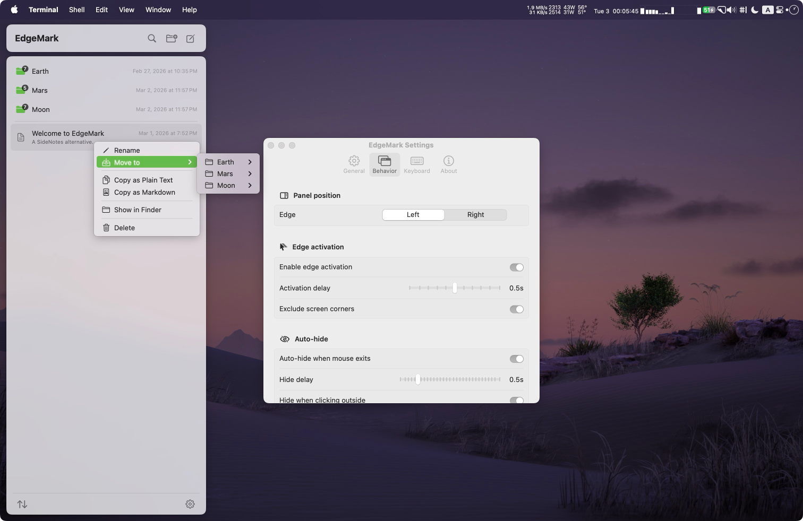

<b><font>EdgeMark</font></b>

 A native macOS side-panel Markdown notes app. Always one edge away.

<br clear="all" />

<p align="center">
  <a href="https://github.com/Ender-Wang/EdgeMark/releases"></a>
  <a href="https://github.com/Ender-Wang/EdgeMark/releases"></a>
  <br />
  
  
  <a href="LICENSE"></a>
</p>

**Why EdgeMark exists:** [SideNotes](https://www.apptorium.com/sidenotes) nailed the interaction — a notes panel that slides in from the screen edge, always one gesture away. But it's closed-source and paid, with no way to contribute, customize, or verify what it does with your data.

EdgeMark is the open-source alternative: **lightweight, Markdown-first**, and yours to inspect, modify, and extend. Your notes are plain `.md` files on disk — open them in any editor, sync with any service, back them up however you want.

<p align="center">
  <picture>
    <source media="(prefers-color-scheme: dark)" srcset=".github/assets/screenshot-dark.png" />
    <source media="(prefers-color-scheme: light)" srcset=".github/assets/screenshot-light.png" />
    
  </picture>
</p>

# Install

```bash
brew install --cask ender-wang/tap/edgemark
```

Or download the latest `.dmg` from [Releases](https://github.com/Ender-Wang/EdgeMark/releases).

---

# Features

🪟 **Side Panel**

- 🔲 Borderless floating panel, full-height, always on top
- 🖥️ Works on every virtual Desktop and alongside fullscreen apps
- ✨ Smooth slide-in/out animation with edge activation — move mouse to screen edge to reveal
- 🖱️ Click outside, Escape, or auto-hide dismissal
- 📐 Multi-monitor support with configurable left or right edge
- ↔️ Adjustable width — drag the inner edge to resize, saved across restarts

✍️ **Markdown Editing**

- 👁️ CodeMirror 6 WYSIWYG editor with cursor-aware live preview (hides syntax, reveals on cursor line)
- 📝 Full Markdown: headings, bold, italic, code, lists, task lists, blockquotes, links, tables
- ⚡ Slash commands (`/h1`, `/todo`, `/code`, `/quote`, `/table`, and more)
- ⌨️ Formatting shortcuts (Cmd+B/I/E/K, Shift+X for strikethrough)
- 🔍 Find & Replace (Cmd+F)

🗂️ **Notes & Storage**

- 📄 Plain `.md` files with YAML front matter — open in any editor, sync with any service
- 📁 Folder-based organization with drag-and-drop
- 📂 Configurable storage directory
- 💾 1-second debounced auto-save
- 🗑️ Trash with 30-day auto-purge and read-only preview

⌨️ **Keyboard & Shortcuts**

- 🌐 Global shortcut: `Ctrl+Shift+Space` toggles from any app (customizable)
- 🎹 Custom shortcut recorder with conflict detection
- ⏱️ Configurable activation delay and corner exclusion zones
- 🔑 Panel shortcuts: `⌘N` new note, `⇧⌘N` new folder, `⌘F` search (when panel is focused)
- 👆 Two-finger trackpad swipe right on the header to navigate back (configurable toggle and sensitivity)

🔄 **Auto-Update & CI/CD**

- 🔔 In-app update check (GitHub Releases, 24h throttle)
- 📦 Download with progress bar, SHA256 verification, install & restart
- ⚙️ GitHub Actions build pipeline (unsigned Release, DMG, SHA256)
- 🍺 Homebrew Cask installation

🌟 **Quality of Life**

- 🌗 Appearance override: System, Light, or Dark mode
- 📌 Menu bar resident (no Dock icon)
- 🚀 Launch at login
- 📋 Copy note as plain text or Markdown source
- 🎨 SF Symbol icons throughout all context menus
- 🔀 Smooth directional page transitions
- 🌍 English + Simplified Chinese (JSON-based, easy to contribute)

---

# Contributing

See [CONTRIBUTING.md](CONTRIBUTING.md) for architecture overview, source tree, key patterns, localization guide, and development setup.

---

# License

EdgeMark is licensed under the [GNU General Public License v3.0](LICENSE).

# Acknowledgments

EdgeMark is built on top of these open-source projects:

| Project | License | Description |
|---------|---------|-------------|
| [CodeMirror 6](https://codemirror.net/) | MIT | Extensible code editor — powers the WYSIWYG Markdown editing experience |
| [Lezer](https://lezer.codemirror.net/) | MIT | Incremental parser system used for live Markdown syntax highlighting |
| [SwiftFormat](https://github.com/nicklockwood/SwiftFormat) | MIT | Code formatting tool used in the build pipeline |

---

# Star History

<a href="https://star-history.com/#Ender-Wang/EdgeMark&Date">
 <picture>
   <source media="(prefers-color-scheme: dark)" srcset="https://api.star-history.com/svg?repos=Ender-Wang/EdgeMark&type=Date&theme=dark" />
   <source media="(prefers-color-scheme: light)" srcset="https://api.star-history.com/svg?repos=Ender-Wang/EdgeMark&type=Date" />
   
 </picture>
</a>
