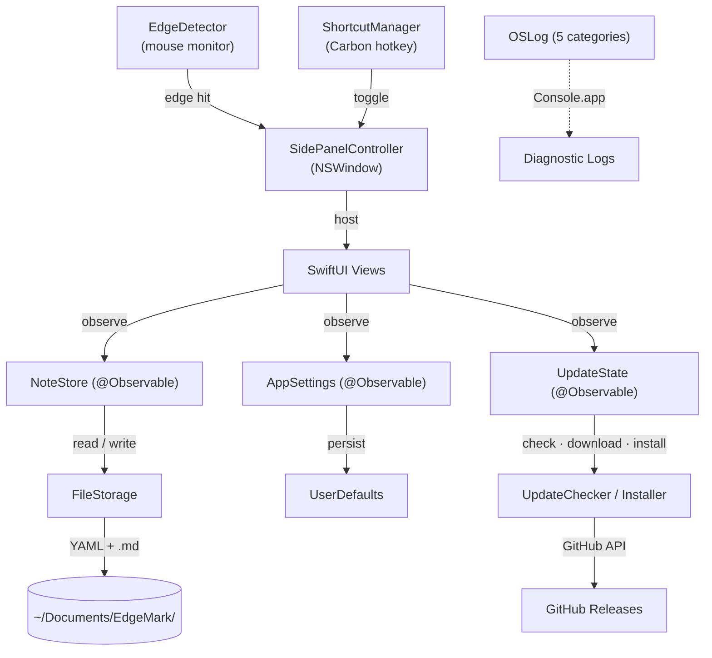

<b><font>EdgeMark</font></b>

 A native macOS side-panel Markdown notes app. Always one edge away.

<br clear="all" />

<p align="center">
  <a href="https://github.com/Ender-Wang/EdgeMark/releases"></a>
  <a href="https://github.com/Ender-Wang/EdgeMark/releases"></a>
  <br />
  
  
  <a href="LICENSE"></a>
</p>

**Why EdgeMark exists:** [SideNotes](https://www.apptorium.com/sidenotes) nailed the interaction — a notes panel that slides in from the screen edge, always one gesture away. But it's closed-source and paid, with no way to contribute, customize, or verify what it does with your data.

EdgeMark is the open-source alternative: **lightweight, Markdown-first**, and yours to inspect, modify, and extend. Your notes are plain `.md` files on disk — open them in any editor, sync with any service, back them up however you want.

<p align="center">
  <picture>
    <source media="(prefers-color-scheme: dark)" srcset=".github/assets/screenshot-dark.png" />
    <source media="(prefers-color-scheme: light)" srcset=".github/assets/screenshot-light.png" />
    
  </picture>
</p>

# Install

```bash
brew install --cask ender-wang/tap/edgemark
```

Or download the latest `.dmg` from [Releases](https://github.com/Ender-Wang/EdgeMark/releases).

---

# Features

**Side Panel**

- Borderless floating panel (400px, full height, always on top)
- Works on every virtual Desktop and alongside fullscreen apps
- Smooth slide-in/out animation with edge activation — move mouse to screen edge to reveal
- Click outside, Escape, or auto-hide dismissal
- Multi-monitor support with configurable left or right edge

**Markdown Editing**

- CodeMirror 6 WYSIWYG editor with cursor-aware live preview (hides syntax, reveals on cursor line)
- Full Markdown: headings, bold, italic, code, lists, task lists, blockquotes, links, tables
- Slash commands (`/h1`, `/todo`, `/code`, `/quote`, `/table`, and more)
- Formatting shortcuts (Cmd+B/I/E/K, Shift+X for strikethrough)
- Find & Replace (Cmd+F)

**Notes & Storage**

- Plain `.md` files with YAML front matter — open in any editor, sync with any service
- Folder-based organization with drag-and-drop
- Configurable storage directory
- 1-second debounced auto-save
- Trash with 30-day auto-purge and read-only preview

**Keyboard & Shortcuts**

- Global shortcut: `Ctrl+Shift+Space` toggles from any app (customizable)
- Custom shortcut recorder with conflict detection
- Configurable activation delay and corner exclusion zones

**Auto-Update & CI/CD**

- In-app update check (GitHub Releases, 24h throttle)
- Download with progress bar, SHA256 verification, install & restart
- GitHub Actions build pipeline (unsigned Release, DMG, SHA256)
- Homebrew Cask installation

**Quality of Life**

- Appearance override: System, Light, or Dark mode
- Menu bar resident (no Dock icon)
- Launch at login
- Copy note as plain text or Markdown source
- SF Symbol icons throughout all context menus
- Smooth directional page transitions
- English + Simplified Chinese (JSON-based, easy to contribute)

---

# Architecture

## Data Flow



## Source Tree

```
EdgeMark/
├── App/                            # Entry point + global state
│   ├── EdgeMarkApp.swift           #   @main, menu bar utility (LSUIElement)
│   ├── AppDelegate.swift           #   Lifecycle, storage migration, shortcut setup
│   └── ContentView.swift           #   Navigation shell (folders → notes → editor)
│
├── Core/                           # Business logic — no SwiftUI imports
│   ├── Editor/
│   │   ├── MarkdownEditorView.swift      # WKWebView ↔ CodeMirror 6 bridge
│   │   ├── ReadOnlyMarkdownView.swift    # Read-only Markdown preview (trash)
│   │   ├── SlashCommandHandler.swift     # /h1, /todo, /code, /quote routing
│   │   └── SlashCommandPopup.swift       # Floating autocomplete popup
│   ├── Settings/
│   │   └── AppSettings.swift       #   @Observable — sort order, date format, prefs
│   ├── Shortcuts/
│   │   ├── ShortcutManager.swift   #   Carbon RegisterEventHotKey global shortcut
│   │   ├── ShortcutSettings.swift  #   UserDefaults persistence for settings
│   │   └── KeyCodeTranslator.swift #   Virtual key code → display string mapping
│   ├── Storage/
│   │   ├── NoteStore.swift         #   @Observable — note CRUD, trash, folders
│   │   ├── FileStorage.swift       #   Plain .md files with YAML front matter
│   │   ├── Note.swift              #   Note model (id, title, body, timestamps)
│   │   ├── Folder.swift            #   Folder model
│   │   └── TrashedFolder.swift     #   Trashed folder with expiry metadata
│   ├── Updates/
│   │   ├── UpdateChecker.swift     #   GitHub Releases API, version comparison
│   │   ├── UpdateDownloader.swift  #   URLSession delegate with progress tracking
│   │   ├── UpdateInstaller.swift   #   DMG mount → verify → copy → replace → restart
│   │   ├── UpdateModels.swift      #   GitHubRelease, UpdateProgress, UpdateError
│   │   ├── UpdateState.swift       #   @Observable — update UI state machine
│   │   └── ChecksumVerifier.swift  #   SHA256 verification via CryptoKit
│   └── Window/
│       ├── SidePanelController.swift     # NSWindowController — show/hide/animate
│       ├── EdgeDetector.swift            # Global mouse monitor → edge activation
│       ├── SettingsWindowController.swift # Settings window lifecycle
│       └── UpdateWindowController.swift  # Update window lifecycle
│
├── UI/                             # SwiftUI views
│   ├── EditorScreen.swift          #   Editor chrome (header, editor, footer)
│   ├── Navigation/
│   │   ├── HomeFolderView.swift    #   Folder list with create/rename/trash
│   │   ├── NoteListView.swift      #   Note cards with search, sort, context menus
│   │   └── TrashView.swift         #   Trash browser with restore/delete/empty
│   ├── Components/                 #   Reusable UI (HeaderIconButton, NoteCardView,
│   │   ├── NSContextMenuModifier.swift  # NSMenu context menus with SF Symbol icons
│   │   ├── NoteListMenus.swift     #   Note/folder context menu builders
│   │   └── ...                     #   InlineRenameEditor, EmptyStateView, etc.
│   └── Settings/
│       ├── SettingsView.swift      #   Tab container (General, Behavior, Keyboard, About)
│       ├── GeneralSettingsTab.swift #   Appearance, language, system, storage
│       ├── BehaviorSettingsTab.swift#   Panel position, edge activation, auto-hide
│       ├── KeyboardSettingsTab.swift#   Shortcut recorder + local shortcuts
│       ├── AboutSettingsTab.swift   #   Version info, links, copyright
│       └── UpdateView.swift        #   Download progress, verify, install UI
│
├── Shared/Utils/
│   ├── L10n.swift                  #   JSON-based i18n runtime
│   ├── Log.swift                   #   OSLog — 5 categories
│   └── Debouncer.swift             #   Generic debounce utility
│
└── Resources/
    ├── Editor/                     # CodeMirror 6 bundle
    │   ├── editor.html             #   WKWebView host page
    │   ├── editor-bundle.js        #   CM6 + WYSIWYG plugin
    │   └── styles.css              #   Editor theme
    └── Locales/                    # i18n strings
        ├── en.json                 #   English
        └── zh-Hans.json            #   Simplified Chinese
```

## Key Patterns

| Pattern | Detail |
|---------|--------|
| **@Observable** | `NoteStore`, `AppSettings`, and `UpdateState` use the `@Observable` macro — views read properties directly, no `@Published` needed |
| **MainActor by default** | `SWIFT_DEFAULT_ACTOR_ISOLATION = MainActor`. All types are `@MainActor` unless explicitly opted out |
| **AppKit + SwiftUI hybrid** | `NSHostingView` embeds SwiftUI inside a borderless `NSWindow`. Panel lifecycle managed by `SidePanelController` (AppKit), UI rendered by SwiftUI |
| **File-based storage** | Notes are plain `.md` files with YAML front matter — no database, readable by any Markdown editor |
| **Carbon hotkeys** | Global shortcut uses `RegisterEventHotKey` (Carbon API) since `NSEvent.addGlobalMonitorForEvents` can't intercept key events |
| **JSON i18n** | `L10n` loads locale JSON at runtime. Access: `l10n["key"]` or `l10n.t("key", arg1, arg2)` for interpolation |
| **OSLog diagnostics** | 5 categorized loggers (app, storage, window, shortcuts, updates). View in Console.app with `subsystem:io.github.ender-wang.EdgeMark` |
| **DMG auto-update** | `UpdateChecker` queries GitHub Releases API. `UpdateInstaller`: mount DMG → verify bundle ID → copy → replace → restart |

---

# Localization

EdgeMark uses a custom JSON-based i18n system. Currently supported:

| Language | File | Status |
|----------|------|--------|
| English | `Resources/Locales/en.json` | ✅ |
| Simplified Chinese | `Resources/Locales/zh-Hans.json` | ✅ |

## Contributing a Translation

1. Copy `Resources/Locales/en.json`
2. Rename to your language code (e.g. `ja.json`, `ko.json`, `fr.json`, `de.json`)
3. Translate the values (keep the keys as-is)
4. Submit a PR

No code changes needed — the app picks up new locale files automatically.

---

# Contributing

**Requirements:** macOS 15.7+, Xcode 16.2+, [Homebrew](https://brew.sh)

```bash
brew install swiftformat
```

Code style is enforced by [SwiftFormat](https://github.com/nicklockwood/SwiftFormat) via CI — rules are in `.swiftformat` at the project root.

---

# License

EdgeMark is licensed under the [GNU General Public License v3.0](LICENSE).

# Acknowledgments

EdgeMark is built on top of these open-source projects:

| Project | License | Description |
|---------|---------|-------------|
| [CodeMirror 6](https://codemirror.net/) | MIT | Extensible code editor — powers the WYSIWYG Markdown editing experience |
| [Lezer](https://lezer.codemirror.net/) | MIT | Incremental parser system used for live Markdown syntax highlighting |
| [SwiftFormat](https://github.com/nicklockwood/SwiftFormat) | MIT | Code formatting tool used in the build pipeline |

---

# Star History

<a href="https://star-history.com/#Ender-Wang/EdgeMark&Date">
 <picture>
   <source media="(prefers-color-scheme: dark)" srcset="https://api.star-history.com/svg?repos=Ender-Wang/EdgeMark&type=Date&theme=dark" />
   <source media="(prefers-color-scheme: light)" srcset="https://api.star-history.com/svg?repos=Ender-Wang/EdgeMark&type=Date" />
   
 </picture>
</a>
